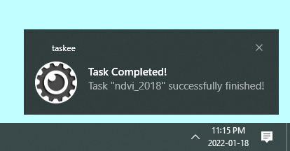

# taskee



## Description

`taskee` is a tool for monitoring `Google Earth Engine` tasks. It runs in the background and can send notifications to your phone or computer to let you know when your tasks finish (or fail). You can run `taskee` in a spare terminal or Jupyter kernel, or even on a dedicated [Raspberry Pi](https://www.raspberrypi.org/) for 24/7 monitoring!

## Features

- 🔍 Monitor [Google Earth Engine](https://developers.google.com/earth-engine) tasks created with the Python API and/or the Javascript Code Editor
- 💻 Native notifications for Linux, Mac, and Windows
- 📱 Mobile push notifications for Android

## Setup


### 1. Install from PyPI
First, install the `taskee` package from PyPI.

```bash
pip install taskee
```

### 2. Set up Earth Engine
Next, make sure you have a [Google Earth Engine](https://developers.google.com/earth-engine) account. If you haven't authenticated Earth Engine before, you'll be asked to do so the first time you run `taskee.initialize()`.

### 3. Set up Pushbullet (Optional)
If you want to receive mobile notifications (Android only), you'll need to create or connect an account with [Pushbullet](https://pushbullet.com), download the app on your device(s), and install the [Pushbullet Python API](https://github.com/rbrcsk/pushbullet.py). 

```bash
pip install pushbullet.py
```

Once you're logged in, go to your [Account Settings](https://www.pushbullet.com/#settings), create an Access Token, and copy the API key. The first time you run `taskee.initialize()` with a `pushbullet` notifier, you'll need to enter your API key. That key will be stored locally so you don't have to enter it again.

## Quickstart

### Interactive

One way to run `taskee` is to set up an interactive Python shell or Jupyter kernel. 

```python
import taskee

# Initialize the Watcher object that will monitor your tasks and notify you of changes.
watcher = taskee.initialize(notifiers="Pushbullet")
# Start watching. Every 10 minutes, you will be notified of any tasks that were completed.
watcher.watch(watch_for="Completed", interval_minutes=10)
```

### Command Line

You can also run `taskee` with the command line interface.

```bash
python -m taskee.cli Completed --interval_mins 10 --notifier Pushbullet
```

For help:
```bash
python -m taskee.cli --help
```

## Events

When an Earth Engine task is updated, it creates an event. You can choose which type of events you're interested from the list below.

| Event | Description |
| ----: | :----- |
| Created | A new task is submitted. |
| Started | A task starts processing. |
| Attempted | An attempt fails and the task is restarted. |
| Completed | A task finished successfully. |
| Failed | A task fails to complete. |
| Cancelled | The user cancels the task. |

## Notifiers

`taskee` supports two notification systems: native operating system notifications and Android push notifications using the [Pushbullet](https://www.pushbullet.com/) service. You can choose which to use every time you run `taskee`.

| Notifier | Description | Platforms Supported |
| ----: | :----- | -----: |
| Native | Local, native notifications. | Linux, Mac, Windows |
| Pushbullet | Mobile push notifications. | Android |
