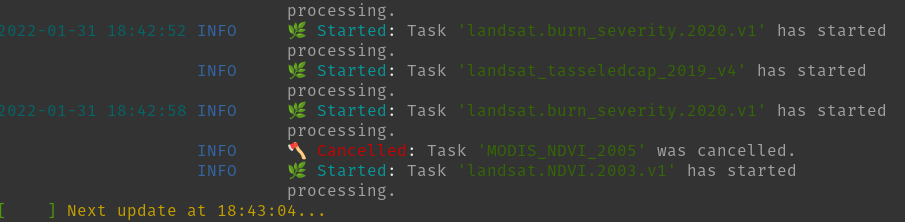

# taskee

`taskee` is a command-line tool for monitoring `Google Earth Engine` tasks that can send notifications to your phone or computer to let you know when your tasks finish (or fail 🤫).


## Features

- 🔍 Monitor [Google Earth Engine](https://developers.google.com/earth-engine) tasks created with the Python API and/or the Javascript Code Editor
- 💻 Native notifications for Linux, Mac, and Windows
- 📱 Mobile push notifications for Android

## Setup

```bash
pip install taskee
```

Run the setup steps below as needed.  
</br>

<details>
  <summary><b>Earth Engine</b> (required)</summary>
  Set up a <a href="https://developers.google.com/earth-engine">Google Earth Engine</a> account. If you haven't authenticated Earth Engine before, you'll be asked to do so the first time you run <code>taskee</code>.
  
</details></br>

<details>
  <summary><b>Pushbullet</b> (optional)</summary>
  If you want to receive mobile notifications (Android only), you'll need to create or connect an account with <a href="https://pushbullet.com">Pushbullet</a>, download the app on your device(s), and install the <a href="https://github.com/rbrcsk/pushbullet.py">Pushbullet Python API</a> using <code>pip install pushbullet.py</code>.
  Once Pushbullet is installed and you're logged in, go to your <a href="https://www.pushbullet.com/#settings">Account Settings</a>, create an Access Token, and copy the API key. The first time you run <code>taskee</code> with a <code>pushbullet</code> notifier, you'll need to enter your API key. That key will be stored locally so you don't have to enter it again.
</details></br>

<details>
  <summary><b>notify-send</b> (Linux only)</summary>
  Linux users may need to install <code>notify-send</code> to enable <code>native</code> notifications. If <code>taskee</code> is not working with the <code>native</code> notifier, run <code>sudo apt install libnotify-bin</code>.
</details>
</br>


## Usage

### Choosing a Mode

There are two "modes" that `taskee` can run in: `dashboard` and `log`. Both modes run continuously until they are cancelled, periodically checking your Earth Engine tasks and sending you notifications.

`dashboard` shows a live-updating dashboard that makes it easy to visually keep track of your tasks and events.

```bash
taskee start dashboard
```


`log` is designed to be run in the background and prints minimal logs as events occur.

```bash
taskee start log
```



### Filtering Events

There are a lot of possible events that can happen to Earth Engine tasks. 

| Event | Description |
| ----: | :----- |
| *created* | A new task is submitted. |
| *started* | A task starts processing. |
| *attempted* | An attempt fails and the task is restarted. |
| *completed* | A task finished successfully. |
| *failed* | A task fails to complete. |
| *cancelled* | The user cancels the task. |
| *error* | `taskee` crashes. |

By default, `taskee` will notify you of `errors` and `completed` or `failed` tasks, but you can specify which events to watch for by listing them when you launch `taskee`. For example:

```bash
taskee start dashboard failed attempted cancelled error
```

You can also use `all` as a shortcut and `taskee` will notify you of all events.

```bash
taskee start dashboard all
```

### Selecting Notifiers

By default, `taskee` will use the `native` notification system built into your computer's operating system. If you want notifications on other devices, set up Pushbullet and then select it with the `-n --notifier` option.

```bash
taskee start dashboard --notifier pushbullet
```

Like with events, you can use `all` as a shortcut and `taskee` will send both `native` and `pushbullet` notifications.

```bash
taskee start dashboard -n all
```

### Other Options

You can set how often tasks are re-checked (in minutes) using the `-i --interval_mins` option. 

```bash
taskee start dashboard -i 10
```

Note: `taskee` doesn't set a minimum interval, but if updates occur too frequently you may run into rate limits for Earth Engine or Pushbullet.

### Example

Using what we learned above, let's set up `taskee` to start running in `log` mode, check for `cancelled` or `completed` task events, send us notifications using `pushbullet`, and update every `30` minutes.

```bash
taskee start log cancelled completed -n pushbullet -i 30
```